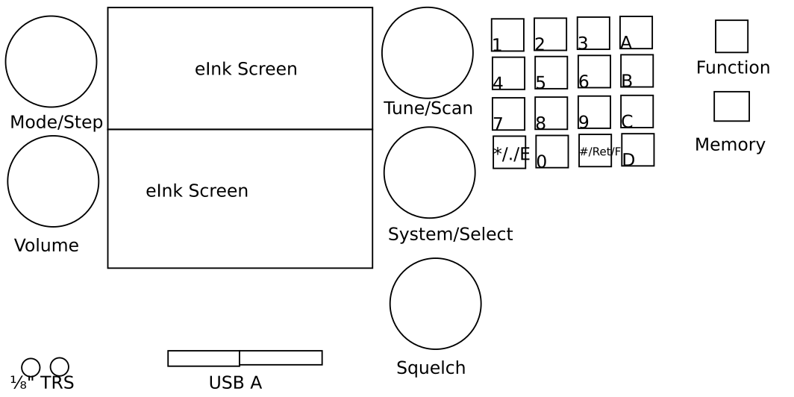

# Subtle Lantern Radio

Showing the way forward.

This is a project to develop an open, libre standalone radio. 

## Front Panel

### Horrible Sketch

### Displays

* 2.7" eInk Display
** Low Power + Visible in Sunlight
** Slow refresh rate
* 5" TFT Display (optional)
** Higher power, not visible in sunlight
** Fast refresh rate

### Audio

* 2 TRRS Jacks
** Pin reconfigurable to support different setups (?)
* 1 RJ45 Jack
** Pin Reconfigurable to support different setups (?)

### Digital

* 2 USB-A jacks

### Buttons/Switches

* 4x4 SPST Momentary Keypad (0-9\*#ABCD)
* DTSP Switch - Numeric vs DTMF pad
* SPST Momentary Button - Function
* SPST Momentary Button - Memory

### Knobs

* 1 Dual-Spindle Knobs w/ detentes
** Radio Primary Function / Radio Secondary Function
* 2 Dual-Spindle Knob w/ detentes w/ push button
** System Primary Function / System Secondary Function / Select
** Radio Tertiary Function / Tune / Scan
* 1 Dual-Spindle Knob w/o detentes
** Audio Gain (Volume) / Squelch

## Back panel

* Antenna 
** 3? (SMA or PL259)? connectors
* Digital
** USB 3 Micro-B
** Ethernet

## Radio Modes

Radio Modes are configurable and extendable, this is just an example. Items
marked † are anticipated in the inital release.

### Configurable

* Potentially just gnuradio files in folders? `$MENU/<top level>/<second level>/<3rd level>.grc`

### Extendible

* Modes should be programs that can be loaded into gnuradio.

#### Modes
* Voice (Primary)
** AM (Secondary)
*** Step Size (Tertiary) †
** USB
*** Step Size †
** LSB
*** Step Size †
** FM
*** Step Size †
* Digital Voice
** FreeDV †
*** ?
* Digital
** MFSK
*** FSK441
*** JT6M
*** JT65
*** FT8 †
*** Olivia MFSK
** AX25
*** APRS
** PSK
*** PSK31 †
*** QPSK31
*** PSK63
*** QPSK63
** FSK
*** 45.45 / 170Hz †

## System Modes

* USB
** Enable MTP
** Enable DFU
** Enable UAC
* Write Raw Data to USB device
** IQ Data (WAV format, stereo L=I R=Q)
** Audio Data (WAV format, stereo L=Rx R=Tx)
* Ethernet
** DHCP/Static (IP/Subnet)
** Stream IQ (multicast/destination:port)
** Stream Audio (multicast/destination:port)
** Enable API
** Enable SSH

## Notes

* Digital Radio Modes can use the TFT screen + USB keyboard for IO or
  appear as a (separate) serial terminal over USB
* Appears as a serial terminal over USB for control
* Device appears as a Device Firmware Upgrade Class USB device for software updates
* Device appears as a Media Transfer Protocol Class USB device for configuration
* Device can be controlled over Ethernet via a REST-like protocol
* Device can stream I/Q data, decoded audio, or decoded data over the network or USB
* Device can act as a USB sound card (UAC 1.0)
* Device can act as an SSH server (`data` and `control` as the ssh command bring up those respective shells)
